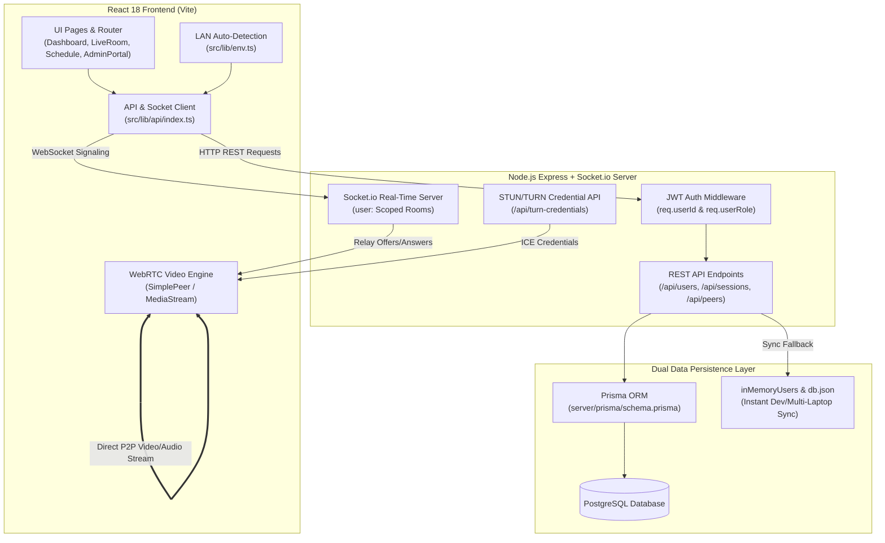
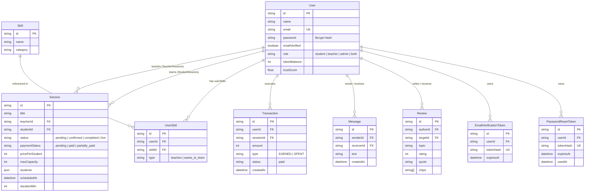
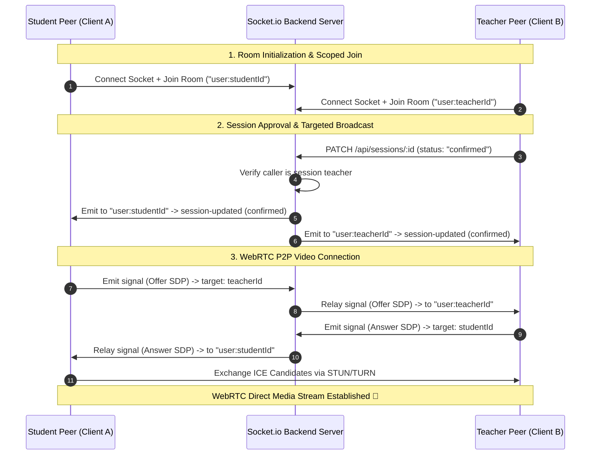

# Mindroot ("Student to Student") Architecture & System Map

> **Developer Maintenance Rule**: This file is the single source of truth for the Mindroot platform's software architecture, database schema, WebRTC signaling workflows, API contracts, and codebase directory layout. Whenever you make architectural changes, add new API endpoints, or modify data models, you MUST update this file accordingly.

---

## 1. High-Level Architecture Overview



---

## 2. Database Entity-Relationship Diagram (ERD)



---

## 3. WebRTC Signaling & Socket.io Room Sequence Diagram



---

## 4. Codebase Directory Structure & Responsibilities Map

```
c:/Users/tanis/Downloads/hackton/Student to Student/
├── server/                              # Express & Socket.io Backend Application
│   ├── src/
│   │   ├── index.ts                     # Main server entry: REST API, Socket.io signaling, JWT middleware
│   │   └── lib/
│   │       └── email.ts                 # Resend & Nodemailer transaction email service
│   ├── prisma/
│   │   ├── schema.prisma                # PostgreSQL data models, indexes & relations
│   │   └── seed.ts                      # Development database seeding script
│   ├── db.json                          # In-memory JSON fallback persistence
│   └── package.json                     # Server dependencies
│
├── src/                                 # React 18 Frontend Application (Vite)
│   ├── pages/                           # Application Page Views
│   │   ├── AdminPortal.tsx              # User management & session oversight dashboard
│   │   ├── Dashboard.tsx                # Main student/teacher overview dashboard
│   │   ├── Feedback.tsx                 # Reviews & star ratings interface
│   │   ├── ForgotPassword.tsx           # Password reset request form
│   │   ├── LiveRoom.tsx                 # WebRTC P2P video classroom & whiteboard
│   │   ├── Login.tsx                    # Credential & Google OAuth authentication
│   │   ├── Marketplace.tsx              # Skill discovery & peer finding
│   │   ├── MatchFinder.tsx              # AI skill matching engine
│   │   ├── Messages.tsx                 # Direct 1-on-1 messaging interface
│   │   ├── Profile.tsx                  # Skill matrix & user settings
│   │   ├── ResetPassword.tsx            # Password reset token confirmation form
│   │   ├── Schedule.tsx                 # Booking, teacher approval & .ics calendar
│   │   ├── TeacherPortal.tsx            # Session requests & teaching management
│   │   ├── VerifyEmail.tsx              # Email verification handler
│   │   └── Wallet.tsx                   # Skill tokens, transactions & payouts
│   ├── components/                      # UI Components
│   │   ├── ErrorBoundary.tsx            # React runtime exception wrapper
│   │   ├── NotificationManager.tsx      # Real-time toast notifications
│   │   └── ui/                          # Design system components
│   ├── lib/
│   │   ├── api/index.ts                 # API client, REST endpoints & Socket listeners
│   │   └── env.ts                       # Dynamic LAN IP origin auto-detection
│   ├── App.tsx                          # App router & layout shell
│   └── main.tsx                         # React DOM entry point
│
└── package.json                         # Frontend dependencies
```

---

## 5. API Endpoint Summary

| Category | Endpoint | Method | Description |
| :--- | :--- | :--- | :--- |
| **Auth** | `/api/auth/register` | `POST` | Registers a new user account with bcrypt password hashing. |
| **Auth** | `/api/auth/login` | `POST` | Authenticates credentials and returns a signed JWT Bearer token. |
| **Auth** | `/api/auth/google` | `POST` | Authenticates Google OAuth 2.0 idToken. |
| **Auth** | `/api/auth/verify-email` | `GET` | Verifies user email address via token. |
| **Auth** | `/api/auth/reset-password` | `POST` | Sets a new password via reset token. |
| **Users** | `/api/users/me` | `GET` | Returns authenticated user profile. |
| **Users** | `/api/peers` | `GET` | Returns public peer profiles excluding requesting user. |
| **Users** | `/api/users/:id` | `PATCH` | Admin-only user details update and password reset. |
| **Sessions** | `/api/sessions` | `GET` | Returns scoped sessions where caller is teacher or student. |
| **Sessions** | `/api/sessions` | `POST` | Books a new peer session (status: `pending`). |
| **Sessions** | `/api/sessions/:id` | `PATCH` | Updates session status (`pending` $\rightarrow$ `confirmed` $\rightarrow$ `completed` / `live`). |
| **Sessions** | `/api/sessions/:id/calendar.ics` | `GET` | Returns `.ics` VCALENDAR file for scoped participants. |
| **Messages**| `/api/messages` | `GET` / `POST` | Fetches and sends direct messages between peers. |
| **Reviews** | `/api/reviews` | `GET` / `POST` | Submits peer ratings and updates target user's `trustScore`. |
| **WebRTC** | `/api/turn-credentials` | `GET` | Serves STUN/TURN server credentials for WebRTC NAT traversal. |

---

## 6. Maintenance Checklist for Developers

When modifying the codebase:
- [ ] **Added a new API endpoint?** Update Section 5 (API Endpoint Summary) and Section 1 (Architecture Flow).
- [ ] **Modified Prisma schema?** Update Section 2 (Database ERD).
- [ ] **Created a new page or component?** Update Section 4 (Codebase Map).
- [ ] **Changed signaling logic or socket rooms?** Update Section 3 (WebRTC Sequence Diagram).
